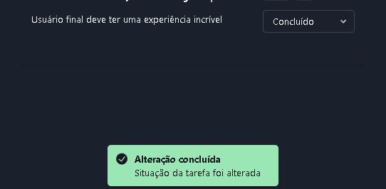

# Chakra UI Skeleton

## Features

- Chakra v2
- React 18.x
- Typescript
- Composition API
- Theme Manager (Dark Mode)
- Todo Example
- React Hook Form Example
- Authentication with Axios Interceptor

## Installation

```
npm install
```

## Run

```
npm start
```

## Screen

### Login


Dark mode enabled


Validation example


### Register


### Task

Task List


Task Modal


Task Edit


Toast Example



User Logout button


